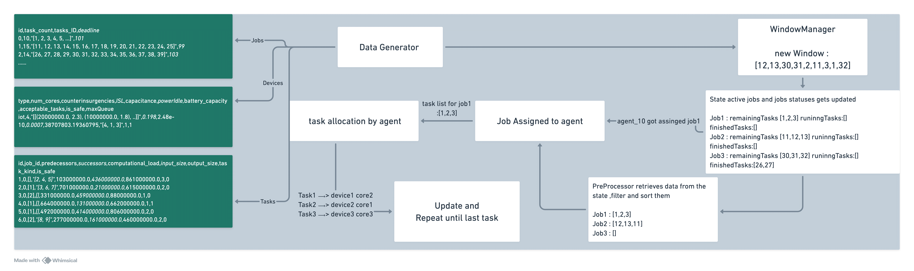

# 🌐 SchEdge: A Dynamic, Multi-agent, and Scalable Scheduling Simulator for IoT Edge



**SchEdge** is a Python-based simulator for evaluating **online task scheduling strategies** in dynamic IoT environments. It supports **multi-agent**, **RL-based**, and **heuristic** approaches, and models heterogeneous devices, real-time task arrivals, and realistic system constraints.

---

## 🧠 Why SchEdge?

> Existing simulators (like iFogSim, EdgeCloudSim) are built for **offline**, **static**, or **Java-heavy** environments.  
> **SchEdge** brings **online**, **learning-based**, and **Python-native** capabilities for researchers working on dynamic scheduling strategies in edge IoT systems.

---

## 🚀 Key Features

- 🧩 **Modular Design**: Plug-and-play environment, schedulers, and preprocessing
- 🕒 **Real-time Task Scheduling**: Tasks arrive in windows, based on DAGs
- 🌍 **Heterogeneous IoT Modeling**: Devices with core counts, battery limits, and queues
- 🔁 **Dynamic Topology**: Devices can join/leave during runtime
- 📊 **Evaluation & Logging**: Time, energy, success rate, reward tracking

---

## 🗂️ Directory Structure

```bash
.
├── configs.py                      # Global config file
├── data/
│   ├── gen.py                      # Dataset generator
│   └── resources/                 # Input datasets
│       ├── jobs.csv
│       ├── scattered_devices.csv
│       └── tasks.csv
├── environment/
│   ├── env.py                      # Core simulation loop
│   ├── pre_processing.py          # DAG filtering and task readiness
│   ├── state.py                   # Simulation state manager
│   ├── util.py                    # Helper functions
│   └── window_manager.py         # Cyclical task feeder
├── model/
│   └── schedulers.py              # Contains offline/online/DRL/EA schedulers
│   └── agent.py              # integrate the scheduler
├── results/                       # Output folder
│   ├── result.png                 # Simulation output graph
│   ├── time.png                   # Iteration time visualization
│   └── summery.csv                # Metric summary
├── main.py                        # Entry point
├── requirments.txt                # Dependency list
├── LICENSE
└── README.md


```

⸻

🛠️ Installation

⚠️ Requires Python 3.8+

# Clone the repo

git clone https://github.com/seyedAliHamedi/SCHEDGE.git

cd SchEdge

# Install dependencies

pip install -r requirments.txt

⸻

🧪 Quick Start

# Run the simulation

python main.py

By default, it will:
• Generate tasks and devices from data/resources/
• Simulate task arrivals in real time
• Save performance logs in results/

⸻

⚙️ Scheduler Configuration & Usage

SchEdge supports plug-and-play scheduler selection via the learning_config in configs.py.

🔧 Select a Scheduler

In configs.py, set:

learning_config = {
...
"scheduler_type": "heuristic", # Options: offline | online | drl | heuristic | evolutionary
...
}

🧠 Scheduler Options

Scheduler Description
offline Greedy, static rule-based scheduler (safe/task-compatible only)
online Neural net-based scheduler (learns to map task features to device/core)
drl Actor-Critic RL scheduler (e.g. PPO, A2C) with reward-driven adaptation
heuristic Rule-based scheduler (fastest + compatible device/core selection)
evolutionary Genetic algorithm that evolves the best device/core/frequency tuple

⸻

🧬 Data Generation

The data generator automatically creates:
• DAG-based job graphs with predecessor-successor relations
• Heterogeneous device pools (IoT, MEC, Cloud)
• Configurable task attributes: computational load, data size, safety

To regenerate synthetic datasets manually, modify data/gen.py or rerun:

python data/gen.py

You can adjust ranges in jobs_config and devices_config inside configs.py.

⸻

📊 Sample Output

✅ Metric 💡 Description
Makespan Total time to finish all tasks
Memory Usage Sampled every 10s to monitor memory trends
Task Success % Ratio of successfully scheduled tasks

Visuals:
• result.png → Behavioral performance of apps and scheduler
• time.png → Scheduler iteration performance

⸻

🧠 Customization

🧾 Change Simulation Settings

Edit configs.py to control:
• DAG structure & task load
• Device heterogeneity
• Reward functions (rewardSetup, alpha, beta)
• Runtime settings (multi_agent, window size)

⸻

📚 Citing Our Work

If you use SchEdge in your research or publication, please cite our work (preprint link coming soon).

⸻

📜 License

MIT License. See LICENSE for details.

---

```

```
