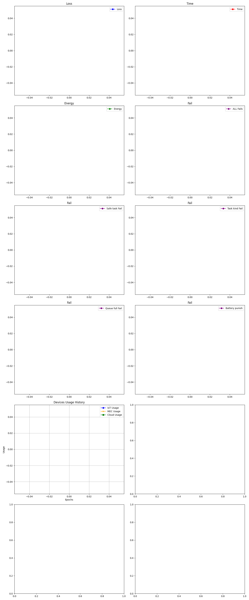

# 🌐 SchEdge: A Dynamic, Multi-agent, and Scalable Scheduling Simulator for IoT Edge



**SchEdge** is a Python-based simulator for evaluating **online task scheduling strategies** in dynamic IoT environments. It supports **multi-agent**, **RL-based**, and **heuristic** approaches, and models heterogeneous devices, real-time task arrivals, and realistic system constraints.

---

## 🧠 Why SchEdge?

> Existing simulators (like iFogSim, EdgeCloudSim) are built for **offline**, **static**, or **Java-heavy** environments.  
> **SchEdge** brings **online**, **learning-based**, and **Python-native** capabilities for researchers working on dynamic scheduling strategies in edge IoT systems.

---

## 🚀 Key Features

- 🧩 **Modular Design**: Plug-and-play environment, agents, and preprocessing
- 🕒 **Real-time Task Scheduling**: Tasks arrive in windows, based on DAGs
- 🤖 **Multi-Agent Reinforcement Learning**: Built-in A3C agent + tree-based models
- 🌍 **Heterogeneous IoT Modeling**: Devices with core counts, battery limits, and queues
- 🔁 **Dynamic Topology**: Devices can join/leave during runtime
- 📊 **Evaluation & Logging**: Time, energy, success rate, and agent reward tracking

---

## 🗂️ Directory Structure

```bash
.
├── configs.py                      # Global config file
├── data/
│   ├── gen.py                      # Dataset generator
│   └── resources/                 # Input datasets
│       ├── jobs.csv
│       ├── scattered_devices.csv
│       └── tasks.csv
├── environment/
│   ├── env.py                      # Core simulation loop
│   ├── pre_processing.py          # DAG filtering and task readiness
│   ├── state.py                   # Simulation state manager
│   ├── util.py                    # Helper functions
│   └── window_manager.py         # Cyclical task feeder
├── model/
│   ├── actor_critic.py            # A3C RL components
│   ├── agent.py                   # Agent wrapper
│   ├── trees/                     # Tree-based learning models
│   │   ├── ClusTree.py
│   │   ├── DDT.py
│   │   └── SoftDDT.py
│   └── utils.py                   # Shared model utilities
├── results/                       # Output folder
│   ├── checkpoints/model.pth      # Trained model
│   ├── result.png                 # Simulation output graph
│   ├── time.png                   # Iteration time visualization
│   └── summery2.csv              # Metric summary
├── main.py                        # Entry point
├── requirments.txt                # Dependency list
├── LICENSE
└── README.md
```

---

## 🛠️ Installation

> ⚠️ Requires Python 3.8+

```bash
# Clone the repo
git clone https://github.com/seyedAliHamedi/SCHEDGE.git

cd SchEdge

# Install dependencies
pip install -r requirments.txt
```

---

## 🧪 Quick Start

```bash
# Run the simulation
python main.py
```

By default, it will:

- Generate tasks and devices from `data/resources/`
- Simulate task arrivals in real time
- Run the A3C multi-agent scheduler
- Save performance logs in `results/`

---

## 📊 Sample Output

| ✅ Metric      | 💡 Description                             |
| -------------- | ------------------------------------------ |
| Makespan       | Total time to finish all tasks             |
| Memory Usage   | Sampled every 10s to monitor memory trends |
| Task Success % | Ratio of successfully scheduled tasks      |
| Agent Reward   | RL feedback per iteration                  |

Visuals:

- `result.png` → Behavioral performance of 3 apps
- `time.png` → Iteration time stability

---

## 🧠 Customization

### 🧾 Change Simulation Settings

Modify `configs.py` to update:

- Window size
- Task arrival rate
- Number of agents
- Scheduling frequency

### 🔁 Plug in Your Own Agent

Replace `model/agent.py` and `model/actor_critic.py` with your own scheduler logic — heuristic, tree-based, or RL.

---

## 📚 Citing Our Work

If you use SchEdge in your research or publications, please cite our corresponding paper.

---

## 📜 License

MIT License. See [LICENSE](./LICENSE) for details.
